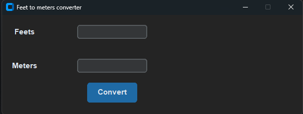

# 🦶 Feet Converter

A simple Python GUI application that converts **Feet to Meters** using CustomTkinter.

---

## 📷 Application Preview

---

## 🚀 Features

- Convert **Feet → Meters**
- Modern GUI using CustomTkinter
- Dark Mode interface
- Simple and beginner-friendly code

---

## 🛠️ Built With

- Python
- CustomTkinter

---

## 📦 Installation

Clone the repository:

git clone https://github.com/username/feet-converter.git

Go to the project folder:

cd feet-converter

Install dependencies:

pip install customtkinter

Run the app:

python app.py

---

## 📂 Project Structure

feet-converter
│
├── app.py
├── README.md
└── screenshot.png

---

## 💡 Future Improvements

- Add **Feet ↔ Meter toggle**
- Better UI design
- Add input validation

---

## 👨‍💻 Author

Karim Hamdi
